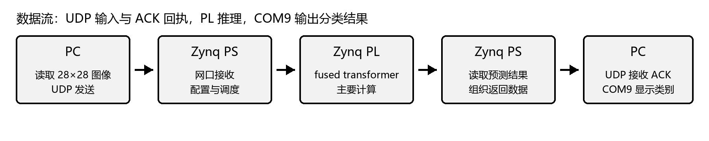

# Zynq-7020 EMNIST Letters TinyViT Deployment

基于 **Zynq-7020 SoC** 的 26 类 EMNIST Letters 轻量 Vision Transformer 软硬件协同部署。模型在 PC 端使用 PyTorch 完成训练、评估与参数导出；Zynq PS 负责网络通信和前后处理，PL 端复用一个 Vitis HLS 融合 Transformer Encoder IP 完成三层主干计算。

> 最终验证版本：3 层 TinyViT、16 路 MAC 展开、62.5 MHz、浮点推理主路径。

## 项目亮点

- 在资源受限的 Zynq-7020 上部署 3 层轻量 ViT，而不是仅验证单个 QKV 或矩阵乘法算子。
- 将 Pre-LayerNorm、QKV、多头自注意力、输出投影、残差与 MLP 融合为单层 HLS IP，由 PS 传入三层参数并复用调度 3 次。
- 采用 16 路 MAC 展开、循环流水化和 cyclic 数组分区，并使用 256 项 GELU LUT、指数及倒平方根近似实现复杂算子。
- 完成 PyTorch 完整测试集评估、520 张类别均衡板测、逐样本软硬件预测比对，以及 Vivado 布线后资源与时序验证。

## 核心结果

| 指标 | 结果 |
| --- | ---: |
| PyTorch 完整测试集准确率 | **90.27%**（18,777 / 20,800） |
| 板端 ViT 主分类准确率 | **90.96%**（473 / 520） |
| 板端与 PyTorch 预测一致率 | **99.81%**（519 / 520） |
| UDP ACK | **100%**（520 / 520） |
| 平均端到端时延 | **42.55 ms / image** |
| P50 / P95 时延 | **42 ms / 45 ms** |
| PL 三层 Transformer 平均耗时 | **37.27 ms** |
| PL 时钟 | **62.5 MHz** |
| 布线后 WNS | **+2.458 ns** |

板测集合从官方 EMNIST Letters test split 中按每类 20 张固定抽取，共 520 张，随机种子为 `20260725`。板端准确率采用未经实验性类别对后处理修改的 ViT 主分类输出，因此可以与 99.81% 的 PyTorch 一致率按同一输出阶段解释。

## 系统架构



### 数据流

```text
PC
  28x28 uint8 image, 784 bytes
        |
        | UDP
        v
Zynq PS
  uint8 -> float -> normalize
  Patch Embedding + CLS token + position embedding
        |
        | AXI / DDR
        v
Zynq PL
  Fused Transformer Encoder IP x 3 calls
        |
        v
Zynq PS
  Final LayerNorm -> 64-to-26 classifier -> argmax
        |
        +--> UDP ACK
        +--> UART prediction and timing
```

### PS/PL 划分

| Zynq PS | Zynq PL |
| --- | --- |
| lwIP/UDP 初始化与 784 字节图像接收 | Pre-LayerNorm |
| 像素浮点化和 `(x-0.1736)/0.3317` 归一化 | QKV 线性投影 |
| `7x7` Patch Embedding | 4 头缩放点积自注意力 |
| CLS token 与位置编码 | Softmax 与 Value 加权 |
| 参数准备、AXI-Lite 配置和 IP 轮询 | 注意力输出投影与残差 |
| 单层 IP 复用调度 3 次 | 第二次 Pre-LayerNorm |
| 最终 LayerNorm、分类头和 argmax | `64 -> 256 -> 64` MLP 与残差 |
| UART 结果及分阶段耗时输出 | GELU、指数和倒平方根近似 |

## 模型结构

| 配置项 | 最终配置 |
| --- | --- |
| 数据集 | EMNIST Letters, A-Z 26 类 |
| 输入 | `1 x 28 x 28` 灰度图 |
| Patch Embedding | `Conv2d(1, 64, kernel=7, stride=7)` |
| Token 数 | 16 patch tokens + 1 CLS token = 17 |
| Embedding dimension | 64 |
| Transformer depth | 3 |
| Attention heads | 4 |
| Head dimension | 16 |
| MLP hidden dimension | 256 |
| Encoder | Pre-LayerNorm |
| 分类方式 | CLS token + final LayerNorm + linear head |
| 参数量 | 156,122 |

Patch Embedding 的卷积核和步长均为 7，patch 之间不重叠，因此它等价于对每个展平后的 `7x7` patch 进行共享线性投影，不是额外部署的卷积 stem。

## PyTorch 训练与参数导出

模型开发阶段使用 PyTorch 完成：

1. 读取 EMNIST Letters，并将标签从 1-26 映射为 0-25。
2. 使用均值 `0.1736`、标准差 `0.3317` 完成输入归一化。
3. 使用 AdamW、交叉熵和余弦学习率调度训练基础 TinyViT。
4. 使用准确率约 95.01% 的 CNN 教师进行知识蒸馏：

   ```text
   loss = 0.9 * hard_cross_entropy + 0.1 * soft_KL
   temperature = 2.5
   label_smoothing = 0.01
   ```

5. 对同构基础模型与蒸馏增强模型进行参数级权重融合：

   ```text
   theta_final = 0.14 * theta_base + 0.86 * theta_accboost
   ```

6. 从最终 `.pt` checkpoint 中导出 Patch、CLS、位置编码、三层 Encoder 与分类头浮点参数，生成 [`src/tinyvit_samples_vitis.h`](src/tinyvit_samples_vitis.h)。

本仓库是板端部署发布包，重点提供 Vitis 裸机固件、HLS IP、生成后的模型参数头文件、硬件产物和验证材料。PyTorch 不在 FPGA 上运行，Zynq 裸机端也不解析 `.pt` 文件。

## HLS 实现

最终 IP 面向 `xc7z020-clg400-1`，使用 Vitis HLS 2020.1 综合：

- `VIT_FUSED_MLP_DIM=256`
- `VIT_FUSED_MAC_UNROLL=16`
- 目标周期 `16 ns`
- HLS 单层估算 `628,137 cycles / 10.050 ms`

### 主要优化

- **16 路 MAC 展开：**点积归约维度按 16 个元素分组，组内并行乘加后使用局部归约树求和。
- **Cyclic partition：**对 token、QKV cache、投影权重行和 MLP 权重行按 factor 16 分区，以提供并行存储访问。
- **循环流水化：**数据搬运和部分 QKV 循环达到 II=1；受浮点归约依赖影响，部分注意力和 MLP 内循环实际为 II=4 或 II=8。
- **复杂算子近似：**GELU 使用 256 项 LUT，Softmax 指数与 LayerNorm 倒平方根使用面向 HLS 的近似实现。

最终融合路径读取浮点权重。仓库中可能保留早期 INT8 实验代码或生成数组，但它们不是本次 520 张验证所使用的主推理路径。

## 板级验证

### 软件参考

最终 PyTorch 模型在 CPU 环境对完整 20,800 张官方测试集重新评估：

```text
correct  = 18,777
total    = 20,800
accuracy = 90.2740%
```

### 520 张类别均衡测试

| 输出阶段 | 正确数 | 准确率 | 与 PyTorch 一致数 | 一致率 |
| --- | ---: | ---: | ---: | ---: |
| PyTorch reference | 472 / 520 | 90.77% | 520 / 520 | 100% |
| Board ViT classifier | **473 / 520** | **90.96%** | **519 / 520** | **99.81%** |

唯一的软硬件类别不一致样本位于决策边界附近：PyTorch 将真实 `L` 预测为 `I`，板端浮点近似结果预测为 `L`。这只能说明近似误差改变了该样本前两类 logit 的排序，不代表板端模型整体精度高于软件模型。

### 时延拆分

| 阶段 | 平均耗时 |
| --- | ---: |
| PS Patch Embedding | 约 4 ms |
| PL 三层 Transformer | 37.27 ms |
| End-to-end inference | **42.55 ms** |

端到端时延统计从板端收到完整图像后开始，包含归一化、Patch Embedding、三层 Transformer、最终 LayerNorm 和分类头，不包含 PC 侧文件读取时间。

## 资源与时序

以下数据来自 Vivado 布局布线后的实现报告，而不是 HLS 早期资源估算：

| Resource | Used | Available | Utilization |
| --- | ---: | ---: | ---: |
| Slice LUTs | 29,073 | 53,200 | 54.65% |
| Slice Registers | 36,542 | 106,400 | 34.34% |
| Block RAM Tile | 68 | 140 | 48.57% |
| DSP48E1 | 121 | 220 | 55.00% |

在 62.5 MHz 下，最终 WNS 为 `+2.458 ns`，所有用户时序约束均满足。原始报告位于：

- [`reports/utilization_placed.rpt`](reports/utilization_placed.rpt)
- [`reports/timing_summary.rpt`](reports/timing_summary.rpt)

## 仓库结构

| Path | 内容 |
| --- | --- |
| [`src/`](src/) | Vitis 裸机应用、最终模型参数和类别对实验参数 |
| [`tools/`](tools/) | HLS 源码、IP 打包、Vivado/Vitis 构建和 UDP 验证脚本 |
| [`drivers/`](drivers/) | `vit_transformer_layer_fused` HLS IP 驱动 |
| [`test_data/`](test_data/) | 26 类基础 UDP 演示样本 |
| [`reports/`](reports/) | 布线后资源、时序和 IP 状态报告 |
| [`assets/`](assets/) | 项目结构图 |
| [`使用说明_26分类EMNIST_ViT部署.md`](使用说明_26分类EMNIST_ViT部署.md) | 中文部署使用说明 |
| [`部署细节_26分类EMNIST_ViT.md`](部署细节_26分类EMNIST_ViT.md) | 中文实现细节 |

## 已提交硬件产物

- `design_1_wrapper_mlp256_u16_rev25.bit`
- `design_1_wrapper_mlp256_u16_rev25.xsa`
- `vit_qvk_test_udp_fused_mlp256_u16_rev25_fixedphy.elf`
- `verify_mlp256_u16_rev25_release_25of26_delay2500.log`

其中 `25/26` 日志是早期固定 26 张演示集的快速连通性验证，不是完整测试集准确率，也不是最新 520 张板测统计。

## 快速验证

默认网络和串口配置：

- Board IP：`192.168.1.10`
- PC IP：`192.168.1.100`
- UDP port：`5001`
- UART：`COM9`, `115200 baud`

完成 FPGA 配置并启动 ELF 后，在仓库根目录执行：

```powershell
powershell -ExecutionPolicy Bypass -File tools\verify_udp_classification_batch.ps1 `
  -DataDir test_data\emnist_letters_udp `
  -VitisHeader src\tinyvit_samples_vitis.h `
  -Count 26 `
  -DelayMs 2500 `
  -SerialPort COM9
```

板端 UART 关键输出：

```text
WAIT_UDP_IMAGE_784_BYTES
UDP_RX_IMAGE len=784
UDP_INFER_BEGIN len=784
UDP_RESULT pred=... path=fused_transformer_pl
```

## 指标说明

- 90.27% 是最终 checkpoint 在官方 EMNIST Letters test split 上的可复现评估结果。训练迭代过程中曾使用该 split 进行 checkpoint 与融合比例选择，因此这里不将其表述为严格未参与模型选择的盲测结果或 SOTA。
- 90.96% 与 99.81% 均对应板端 ViT 主分类器输出。实验性 PS 类别对后处理不计入加速器结果。
- 42.55 ms 是板端端到端推理时延；HLS 报告中的 10.050 ms 是单层 IP 的综合估算，两者统计范围不同。
- 资源数据来自最终 Vivado placed/routed design，不能与 HLS 资源估算混用。

## Author

**Yufeng Zhou**<br>
[GitHub @JustinZhouYuFeng](https://github.com/JustinZhouYuFeng)
